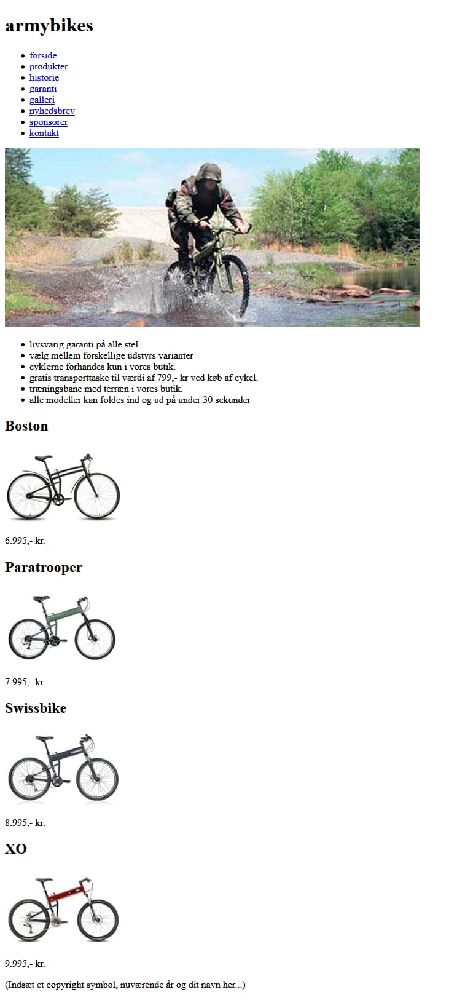
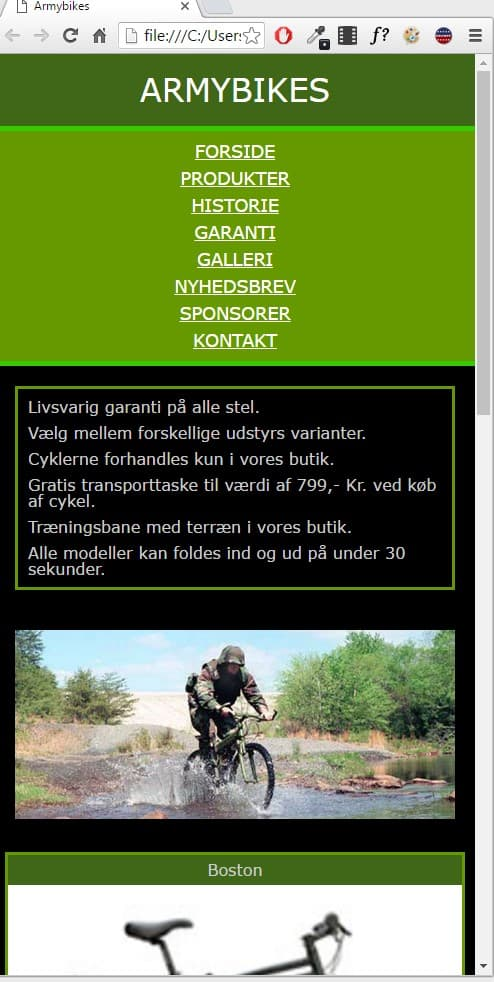
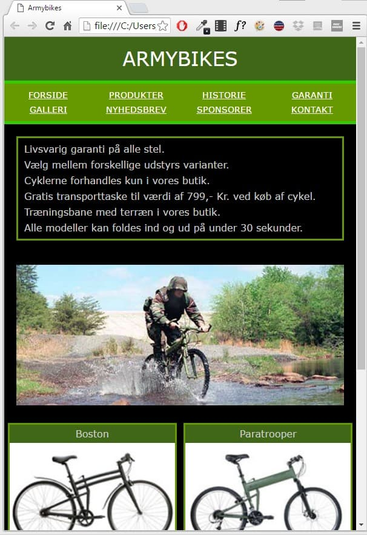
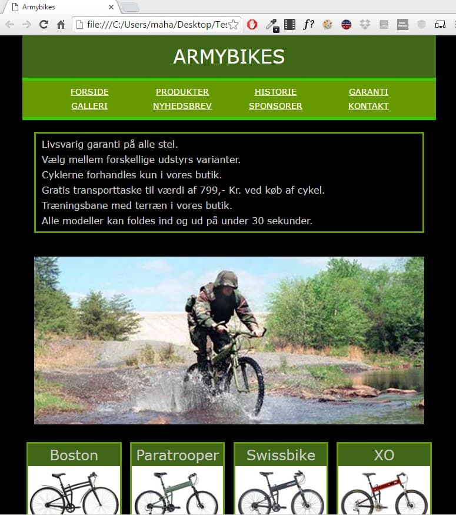
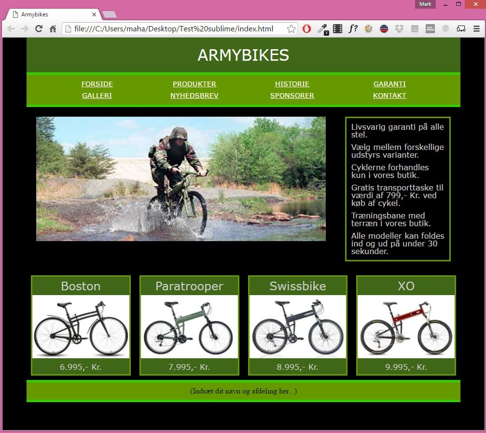

# Opsamlingsopgave armybikes
Formålet med opgaven er at genopfriske din html og css kompetencer fra V1. Opgaven er delt op i trin der afspejler en rækkefølge som du kan bruge til andre webside opgaver.

## Inden du går i gang
Du skal have kendskab til semantiske html elementer og hvordan du styler dem med css. Der er følgende krav til siden:

* Siden skal være responsiv og laves mobile first
* Brug github under udviklingen
* Brug et CSS bibliotek til at give konsistens på tværs af browsere. Det kan enten fx være [cssremedy](https://github.com/jensimmons/cssremedy) eller [sanitize.css](https://github.com/csstools/sanitize.css)
* Du må gerne bruge et framework som bootstrap eller tailwindcss
* Hvis du har kenskab til SCSS eller lignende så må du gerne bruge det
* Det hele skal wrappes ind i en div 


## Trin 1 - HTML strukturen
Start med at lave din `index.html` fil og sæt den op så der ser sådan her ud



## Trin 2 - Inkluder CSS reset bibliotek
Download enten cssremedy eller sanitize.css, gem i din css mappe og link til det i `index.html`.


## Trin 3 - CSS variabler og skrifttyper
I begyndelsen af din CSS fil skal du nu have sat dine CSS Custom Properties (css variabler) op. Der skal minimum oprettes varibler til tekstfarve, de grønne farver og baggrunden. Sæt også variabler op til skrifttypen.

```css
:root {
  --green-500: hsl(90, 62%, 25%);
  --green-400: hsl(80, 100%, 30%);
  --green-300: hsl(105, 100%, 40%);

  --text-color: hsl(0, 0%, 95%); 

  --bg-color: hsl(0, 0%, 0%);

  --font-family:Verdana, ui-sans-serif, sans-serif; 
}
```
Du kan bruge dine variabler sådan her
```css
article {
  background-color: var(--green-500);
}
```

### Skrifttyper
Sæt resten af skriften op. Alt skriften skal være Verdana. Lad være med at sætte den flere steder, husk i stedet på [inheritance](https://developer.mozilla.org/en-US/docs/Web/CSS/inheritance).

* Header - 2rem
* Navigation - .9rem
* Produkt overskrift - 1.5rem
* Produkt footer - 1rem
* Footer - 1rem

## Trin 4 - Styling af header og nav
Nu skal du begynde på at lave hver del af siden fra top til bund. Start med header der skal have de korrekte farver og så skal tekst placeres korrekt. For at placere ARMYBIKES anbefales det at du centrere den med [flexbox](https://css-tricks.com/snippets/css/a-guide-to-flexbox/).


## Trin 5 - Styling af main
Main består af to sektioner. Den første som en slags introduktion med et flot billede og highlights af butikken. Den anden sektion er en liste af featured produkter. 

### Trin 5.1 - Introduktion
Sæt billede og liste op så de ser ud på billedet.

### Trin 5.2 - Produkter
Start inde fra og ud. Lav først dine produkt cards, lav så bagefter sektionen uden omkring.

## Trin 6 - Footer
Ligner meget hvordan sidens header blev stylet. 

## Trin 7 - Responsiv
Herunder kommer en række screenshots af hvordan siden opfører sig ved bestemte skærmbredder:

### Over 500px
Her er navigationen blevet lodret (og betragteligt mere grim) – med andre ord står der nu kun et punkt på hver linje. Produkterne fylder nu 100% af bredden (med en lille margin).


### Over 600px
Her fylder wrapperen 100% og hvert af produkterne fylder 50% så der kun kan stå to på en linje.


### Over 800px
Her står det store billede nedenunder teksten i den grønne ramme. Hvis du bruger floats, kan du måske ikke få teksten til at stå øverst, men hvis du bruger flex kan du (hint: order).


### Over 1000px
Wrapperen fylder nu 90%
Navigationen fylder nu 2 linjer – eller hvert menupunkt fylder med andre ord 25% af pladsen.


## Ekstraopgaver
1. Lav hover effekt til navigation og produkt cards
2. Lav navigationen bedre så den også ser godt ud på en iphone 5.
3. Lav et bedre design
